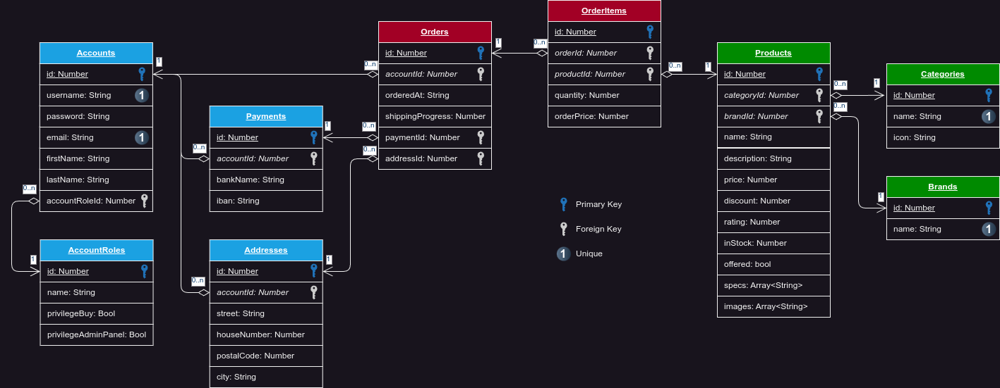

# HackMyCart

The most hackable Web Shop!

## How to use

### Prepare development environment

1. Install node.js

```bash
sudo apt install npm

# If outdated version:
sudo npm install -g n
sudo n stable
```

2. Download + extract the project
3. Open the root folder with VS Code (recommended)
4. Open the bash inside VS Code and install all necessary packages:

```bash
npm i
```

### Test/development

There are multiple commands to test parts or the whole project:

- `npm run vite:dev`: Start Vue frontend only
- `npm run server:dev`: Start ExpressJs backend only
- `npm run fullstack:dev`: Start front- and backend

The frontend runs on `http://localhost:5173/` and the backend on `http://localhost:3000/`

### Build

- `npm run vite:build`: Build Vue frontend only
- `npm run server:build`: Build ExpressJs backend only
- `npm run fullstack:build`: Build front- and backend
- `npm run electron:build`: Build front- and backend to an Electron desktop application
- `npm run builder:build`: Build an installer file of the Electron application for current operating system. Electron-build has to run first!
- `npm run builder:win`: Build an installer file of the Electron application for Windows operating systems. Electron-build has to run first!

## Structure

### Database



### Backend API endpoints

The application host it's data in a SQLite database. The access is managed by an [ExpressJs](https://expressjs.com/) server which offers many REST-API endpoints for the frontend. The REST-API server runs on port 3000.

---

#### Listing existing

<details open>
<summary><code><span style="color:#70AFFD"><b>GET</b></span></code> <code><b>/accounts/</b></code> <code> (Get all Accounts)</code>
</summary>

##### Parameters
> None

##### Responses
> | http code | content-type | response |
> | :---: | --- | --- |
> | `200` | `application/json` | `Array<Account + AccountRole>`  |

##### Example Response
```json
[
  {
    "id": 421,
    "username": "hagemeister93",
    "password": "Xjt3qb5t",
    "email": "hagemeister93@gmail.com",
    "firstName": "Laurin",
    "lastName": "Hagemeister",
    "accountRoleId": 2,
    "accountRole": {
      "id": 2,
      "name": "Admin",
      "privilegeBuy": true,
      "privilegeAdminPanel": true
    }
  }
]
```

</details>

<details open>
<summary><code><span style="color:#70AFFD"><b>GET</b></span></code> <code><b>/api/files</b></code> <code> (Get all public files)</code>
</summary>

##### Parameters
> None

##### Responses
> | http code | content-type | response |
> | :---: | --- | --- |
> | `200` | `application/json` | `Array<{folder: String, files: Array<{name: String, size: Number, url: String}> }>`  |

##### Example Response
```json
[
  {
    "folder": "artists",
    "files": [
      {
        "name": "alex-turner.jpg",
        "size": 56473,
        "url": "http://localhost:3000/static/artists/alex-turner.jpg"
      },
      {
        "name": "andy-nicholson.jpg",
        "size": 68983,
        "url": "http://localhost:3000/static/artists/andy-nicholson.jpg"
      }
    ]
  }
]
```
</details>

<details open>
<summary><code><span style="color:#70AFFD"><b>GET</b></span></code> <code><b>/bands/</b></code> <code> (Get all bands)</code>
</summary>

##### Parameters
> | name | type | data type | description |
> | :---: | --- | --- | --- |
> | `sort` |  optional | string   | Sort by number of concerts ascending (asc) or descending (desc) |
> | `count` |  optional | number   | Number of items to responde |

##### Responses
> | http code | content-type | response |
> | :---: | --- | --- |
> | `200` | `application/json` | `Array<>`  |

##### Example Response
```json
[
  {
    "folder": "artists",
    "files": [
      {
        "name": "alex-turner.jpg",
        "size": 56473,
        "url": "http://localhost:3000/static/artists/alex-turner.jpg"
      },
      {
        "name": "andy-nicholson.jpg",
        "size": 68983,
        "url": "http://localhost:3000/static/artists/andy-nicholson.jpg"
      }
    ]
  }
]
```
</details>


<details>
<summary><code><span style="color:#70AFFD"><b>GET</b></span></code> <code><b>/events?city=cityName&genre=genreName&count=nrOfItems&sort=sortDirection</b></code> <code> (Get all events, filtered by city and genre)</code>
</summary>

##### Parameters
> | name | type | data type | description |
> | :---: | --- | --- | --- |
> | `cityName` |  optional | string   | Name of the city to filter for  |
> | `genreName` |  optional | string   | Name of the genre to filter for  |
> | `nrOfItems` |  optional | number   | Limits number of results |
> | `sortDirection` |  optional | string   | Sort by number of concerts, 'asc' or 'desc' |

##### Responses
> | http code | content-type | response |
> | :---: | --- | --- |
> | `200` | `application/json` | `Array<Event + Array<Concert + Location + City> + Band & Genre>`  |
</details>


<details>
<summary><code><span style="color:#70AFFD"><b>GET</b></span></code> <code><b>/locations?count=nrOfItems&sort=sortDirection</b></code> <code> (Get all locations)</code>
</summary>

##### Parameters
> | name | type | data type | description |
> | :---: | --- | --- | --- |
> | `nrOfItems` |  optional | number   | Limits number of results |
> | `sortDirection` |  optional | string   | Sort by number of concerts, 'asc' or 'desc' |

##### Responses
> | http code | content-type | response |
> | :---: | --- | --- |
> | `200` | `application/json` | `Array<Location + City + Array<Concert + Event>>`  |
</details>


Down here: todo!


<details>
<summary><code><span style="color:#70AFFD"><b>GET</b></span></code> <code><b>/bands</b></code> <code> (Get all bands)</code>
</summary>

##### Parameters
> None

##### Responses
> | http code | content-type | response |
> | :---: | --- | --- |
> | `200` | `application/json` | `Array<Band>`  |
</details>


<details>
<summary><code><span style="color:#70AFFD"><b>GET</b></span></code> <code><b>/bands/:id</b></code> <code> (Get all information about one band)</code>
</summary>

##### Parameters
> | name | type | data type | description |
> | :---: | --- | --- | --- |
> | `id` |  required | string   | ID of product in the database  |

##### Responses
> | http code | content-type | response |
> | :---: | --- | --- |
> | `200` | `application/json` | `Band` + `Array<Rating>` + `Array<Member>`  |
</details>


<details>
<summary><code><span style="color:#70AFFD"><b>GET</b></span></code> <code><b>/shows/:id</b></code> <code> (Get all information about one show)</code>
</summary>

##### Parameters
> | name | type | data type | description |
> | :---: | --- | --- | --- |
> | `id` |  required | string   | ID of product in the database  |

##### Responses
> | http code | content-type | response |
> | :---: | --- | --- |
> | `200` | `application/json` | `Show` + `Tour` + `Location` + `City`  |
</details>


<details>
<summary><code><span style="color:#70AFFD"><b>GET</b></span></code> <code><b>/tours</b></code> <code> (Get all tours)</code>
</summary>

##### Parameters
> None

##### Responses
> | http code | content-type | response |
> | :---: | --- | --- |
> | `200` | `application/json` | `Array<Tours>` + `Band` + `Show` + `Location` + `City`  |
</details>


<details>
<summary><code><span style="color:#70AFFD"><b>GET</b></span></code> <code><b>/genres</b></code> <code> (Get all genres)</code>
</summary>

##### Parameters
> None

##### Responses
> | http code | content-type | response |
> | :---: | --- | --- |
> | `200` | `application/json` | `Array<Genre>`  |
</details>


<details>
<summary><code><span style="color:#70AFFD"><b>GET</b></span></code> <code><b>/orders/:id</b></code> <code> (Get all orders of an user)</code>
</summary>

##### Parameters
> | name | type | data type | description |
> | --- | --- | --- | --- |
> | `id` |  required | string   | ID of userAccount in the database  |

##### Responses
> | http code | content-type | response |
> | :---: | --- | --- |
> | `200` | `application/json` | `ProductModel` + `Order`, `OrderItem`, `Product`  |
</details>


<details>
<summary><code><span style="color:#70AFFD"><b>GET</b></span></code> <code><b>/categories/</b></code> <code> (Get all Categories)</code>
</summary>

##### Parameters
> None

##### Responses
> | http code | content-type | response |
> | :---: | --- | --- |
> | `200` | `application/json` | `Array<Categories>` |
</details>


<details>
<summary><code><span style="color:#70AFFD"><b>GET</b></span></code> <code><b>/brands</b></code> <code> (Get all Brands)</code>
</summary>

##### Parameters
> None

##### Responses
> | http code | content-type | response |
> | :---: | --- | --- |
> | `200` | `application/json` | `Array<Brand>` |
</details>


---


#### Creating new

<details>
<summary><code><span style="color:#69CA92"><b>POST</b></span></code> <code><b>/accounts/</b></code> <code> (Create a new account)</code>
</summary>

##### Parameters
> | name | type | data type | description |
> | :---: | --- | --- | --- |
> | None |  required | object (JSON) | Model of an Account |

##### Responses
> | http code | content-type | response |
> | :---: | --- | --- |
> | `201` | `application/json` | `AccountModel`  |
> | `400` | `application/json` | `{code: 400, message: "Username too short!"}` |
> | `400` | `application/json` | `{code: 400, message: "Password too short!"}` |
> | `409` | `application/json` | `{code: 409, message: "Username already in use"}` |
</details>


<details>
<summary><code><span style="color:#69CA92"><b>POST</b></span></code> <code><b>/orders/</b></code> <code> (Create a new order)</code>
</summary>

##### Parameters
> | name | type | data type | description |
> | :---: | --- | --- | --- |
> | None |  required | object (JSON) | Model of an Order |

##### Responses
> | http code | content-type | response |
> | :---: | --- | --- |
> | `201` | `application/json` | `OrderModel`  |
</details>

---

#### Updating existing

<details>
<summary><code><span style="color:#F3A63D"><b>PATCH</b></span></code> <code><b>/accounts/</b></code> <code> (Update data of an existing account)</code>
</summary>

##### Parameters
> | name | type | data type | description |
> | :---: | --- | --- | --- |
> | None |  required | object (JSON) | Model of an Account |

##### Responses
> | http code | content-type | response |
> | :---: | --- | --- |
> | `200` | `application/json` | AccountModel  |
> | `400` | `application/json` | `{code: 400, message: "..."}` |
</details>

---

#### Delete existing

<!-- <details>
<summary><code><span style="color:#EB5246"><b>DELETE</b></span></code> <code><b>/product/:id</b></code> <code> (Delete a product)</code>
</summary>

##### Parameters
> | name | type | data type | description |
> | :---: | --- | --- | --- |
> | `id` |  required | string | ID of product in the database |

##### Responses
> | http code | content-type | response |
> | :---: | --- | --- |
> | `200` | `application/json` | `ProductModel`  |
> | `400` | `application/json` | `{code: 400, message: "..."}` |
</details> -->

---

#### Miscs

<details>
<summary><code><span style="color:#70AFFD"><b>GET</b></span></code> <code><b>/api/</b></code> <code> (Check if server runs)</code>
</summary>

##### Parameters
> None

##### Responses
> | http code | content-type | response |
> | :---: | --- | --- |
> | `200` | None | None |
</details>

<details>
<summary><code><span style="color:#70AFFD"><b>GET</b></span></code> <code><b>/resetDatabase/</b></code> <code> (Reset the database to it's default values)</code>
</summary>

##### Parameters
> None

##### Responses
> | http code | content-type | response |
> | :---: | --- | --- |
> | `200` | None | None |
</details>


#### Validate

<details>
<summary><code><span style="color:#69CA92"><b>POST</b></span></code> <code><b>/accounts/login</b></code> <code> (Login for user)</code></summary>

##### Parameters
> | name | type | data type | description |
> | --- | --- | --- | --- |
> | username |  required | string   | Username of the account  |
> | password |  required | string   | Password of the account  |

##### Responses
> | http code | content-type | response |
> | :---: | --- | --- |
> | `200` | `application/json` | `AccountObject` + `Addresses`, `Payments`, `AccountRole`  |
> | `400` | `application/json` | `{code: 400, message: "Bad Request"}` |
> | `401` | `application/json` | `{code: 401, message: "Unauthorized"}` |
</details>

---