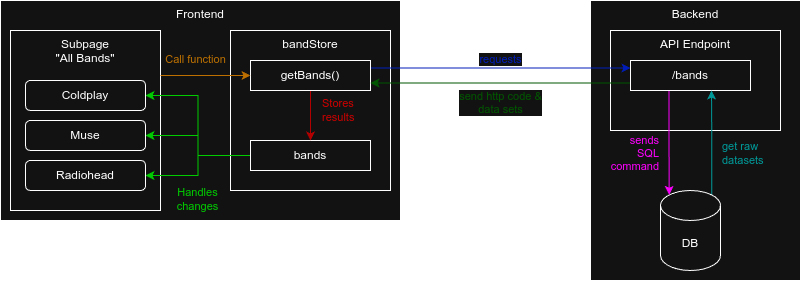

<p align="center">
  
</p>

<h1 align="center">EventMaster</h1>
<h2 align="center">The most hackable Ticket-Shop!</h2>


## About the project

EventMaster is a desktop application for simulating various hacking methods for web applications. It's the perfect tool to understand  vulnerabilities in modern web applications.

The shop offers tickets for concerts of popular bands with a complete ordering system, account management and admin interface. The program has been deliberately provided with vulnerabilities for teaching purposes, e.g. SQL injections. If a task is solved and a vulnerability is identified, the system provides visual feedback. The progress can be viewed on an overview page.

This project is created during my Bachelor thesis. It will be used at Leibniz University Hannover for foundation lectures.

## Important notes!
- ⚠️ The project is under development, bugs may occur
- ⚠️ The software is developed for educational purposes, don't use the attack techniques without permission on other applications and systems!
- ⚠️ Works 100% offline, no data transmission to or from external services

## Features
- 13 exercises
- 3 attack techniques
  - SQL-Injections
  - Cross-Site-Scripting
  - Broken Access Control
- Exercise control system - check the progress and get feedback for solved exercises!
- Full working ticket shop:
  - Vuetify design
  - Account management system
  - Order process system
  - Event locations with seat plan and seat reservation system during ordering process
  - Global search
  - Admin panel
  - Product pages
  - ExpressJs-Backend server
  - REST-API
  - SQLite Database
- URL simulation bar for electron application
- Works 100% offline
- Multi language support (German, English)
- Dark/Light-Mode
- Exercise progress PDF generation
- API-Documentation with Swagger
- Desktop application packed with Electron
- Database can be resetted complete or partially

### Techstack

- Axios
- Electron
- Electron Builder
- Express.js
- JsonWebToken
- jspdf
- Moment.js
- NPM
- Nodemon
- Pinia
- Sequelize
- SQLite 3
- Swagger
- TypeScript
- Vite
- Vue i18n
- Vue.js
- VueRouter
- Vuetify

### Planned features

- More attack techniques
- More exercises
- More languages
- Customize the offered set of exercises (for trainer)
- Image license view system (currently only in admin panel)

### Screenshots

#### Band Detail page


#### Booking page


#### Admin panel


#### Global search


#### Feedback on exercise solution


## How to use

### Download pre-builded images

Go to releases and download one of the pre-builded images for your operating system.

### Build yourself

1. Download + extract the project
2. Open the root folder with VS Code (recommended)
3. Open the bash inside VS Code and install all necessary packages:

```bash
npm i
```

#### Test/development

There are multiple commands to test parts or the whole project:

- `npm run vite:dev`: Start Vue frontend only
- `npm run server:dev`: Start ExpressJs backend only
- `npm run fullstack:dev`: Start front- and backend

The frontend runs on `http://localhost:5173/` and the backend on `http://localhost:3000/`

#### Build

- `npm run vite:build`: Build Vue frontend only
- `npm run server:build`: Build ExpressJs backend only
- `npm run fullstack:build`: Build front- and backend
- `npm run electron:build`: Build front- and backend to an Electron desktop application
- `npm run builder:build`: Build an installer file of the Electron application for current operating system. Electron-build has to run first!
- `npm run builder:win`: Build an installer file of the Electron application for Windows operating systems. Electron-build has to run first!

## Structure

### Database


### Frontend-Backend-System


