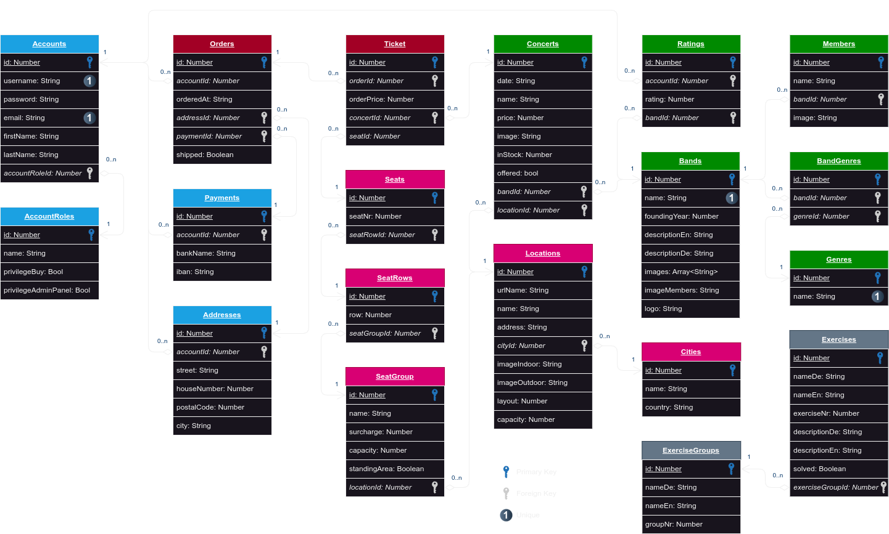

# HackMyCart

The most hackable Web Shop!

## How to use

### Prepare development environment

1. Install node.js

```bash
sudo apt install npm

# If outdated version:
sudo npm install -g n
sudo n stable
```

2. Download + extract the project
3. Open the root folder with VS Code (recommended)
4. Open the bash inside VS Code, navigate to the `software/` folder and install all necessary packages:

```bash
npm i
```

### Test/development

There are multiple commands to test parts or the whole project:

- `npm run dev`: Starts the Vue frontend only
- `npm run server`: Starts the ExpressJs backend only
- `npm run serve`: Starts front- and backend

The frontend runs on `http://localhost:5173/` and the backend on `http://localhost:3000/`

### Compile for production

TODO

## Structure

### Database



### Backend API endpoints

The application host it's data in a SQLite database. The access is managed by an [ExpressJs](https://expressjs.com/) server which offers many REST-API endpoints for the frontend. The REST-API server runs on port 3000.

#### `/api`

<details style="border: solid; border-radius: 10px; border-color: #70AFFD; margin-bottom: 20px">
<summary style="background-color: #70AFFD; color: #FFFFFF; border: none; padding: 10px 20px; border-radius: 6px 6px 0px 0px; font-weight: bold">Server check</summary>
<div style="padding: 0px 20px 10px">

<h4>Description</h4>
Check if server is available

<h4>Request</h4>
<code>GET /api</code>

<br>

<table>
<header>
  <th>Parameter</th>
  <th>Required?</th>
  <th>Description</th>
</header>
<tbody>
  <tr>
    <td>-</td>
    <td>-</td>
    <td>-</td>
  </tr>
</tbody>
</table>
</div>
</details>


<details style="border: solid; border-radius: 10px; border-color: #70AFFD; margin-bottom: 20px">
<summary style="background-color: #70AFFD; color: #FFFFFF; border: none; padding: 10px 20px; border-radius: 6px 6px 0px 0px; font-weight: bold">Database reset</summary>
<div style="padding: 0px 20px 10px">

<h4>Description</h4>
Delete and refill the database with example values

<h4>Request</h4>
<code>GET /api/resetdatabase</code>

<br>

<table>
<header>
  <th>Parameter</th>
  <th>Required?</th>
  <th>Description</th>
</header>
<tbody>
  <tr>
    <td>-</td>
    <td>-</td>
    <td>-</td>
  </tr>
</tbody>
</table>
</div>
</details>

#### `/categories`

<details style="border: solid; border-radius: 10px; border-color: #70AFFD; margin-bottom: 20px">
<summary style="background-color: #70AFFD; color: #FFFFFF; border: none; padding: 10px 20px; border-radius: 6px 6px 0px 0px; font-weight: bold">All categories</summary>

<div style="padding: 0px 20px 10px">

<h4>Description</h4>
Get all categories

<h4>Request</h4>
<code>GET /categories</code>

<br>

<table>
<header>
  <th>Parameter</th>
  <th>Required?</th>
  <th>Description</th>
</header>
<tbody>
  <tr>
    <td>-</td>
    <td>-</td>
    <td>-</td>
  </tr>
</tbody>
</table>

<h4>Example Response</h4>

```json
[
  {
    "id": 0,
    "name": "Electronic",
    "icon": "mdi-chip",
    "createdAt": "2024-09-13T07:51:40.118Z",
    "updatedAt": "2024-09-13T07:51:40.118Z"
  },
  {
    "id": 1,
    "name": "Sports",
    "icon": "mdi-soccer",
    "createdAt": "2024-09-13T07:51:40.118Z",
    "updatedAt": "2024-09-13T07:51:40.118Z"
  }
]
```
</div>
</details>


<details style="border: solid; border-radius: 10px; border-color: #69CA92; margin-bottom: 20px">
<summary style="background-color: #69CA92; color: #FFFFFF; border: none; padding: 10px 20px; border-radius: 6px 6px 0px 0px; font-weight: bold">Add new category</summary>
<div style="padding: 0px 20px 10px">

<h4>Description</h4>
Add a new category

<h4>Request</h4>
<code>POST /categories</code>

<br>

<table>
<header>
  <th>Body Parameters</th>
  <th>Required?</th>
  <th>Description</th>
</header>
<tbody>
  <tr>
    <td><code>name</code></td>
    <td>Yes</td>
    <td>Name of the category</td>
  </tr>
  <tr>
    <td><code>icon</code></td>
    <td>Yes</td>
    <td>Material Design Icon</td>
  </tr>
</tbody>
</table>
</div>
</details>


<details style="border: solid; border-radius: 10px; border-color: #EB5246; margin-bottom: 20px">
<summary style="background-color: #EB5246; color: #FFFFFF; border: none; padding: 10px 20px; border-radius: 6px 6px 0px 0px; font-weight: bold">Delete category</summary>
<div style="padding: 0px 20px 10px">

<h4>Description</h4>
Delete a category by it's id

<h4>Request</h4>
<code>DELETE /categories/:id</code>

<br>

<table>
<header>
  <th>Parameter</th>
  <th>Required?</th>
  <th>Description</th>
</header>
<tbody>
  <tr>
    <td><code>id</code></td>
    <td>Yes</td>
    <td>Database ID of CategoryModel</td>
  </tr>
</tbody>
</table>
</div>
</details>

#### `/products`

<details style="border: solid; border-radius: 10px; border-color: #70AFFD; margin-bottom: 20px">
<summary style="background-color: #70AFFD; color: #FFFFFF; border: none; padding: 10px 20px; border-radius: 6px 6px 0px 0px; font-weight: bold">All products</summary>
<div style="padding: 0px 20px 10px">

<h4>Description</h4>
Get all products

<h4>Request</h4>
<code>GET /products</code>

<br>

<table>
<header>
  <th>Parameter</th>
  <th>Required?</th>
  <th>Description</th>
</header>
<tbody>
  <tr>
    <td>-</td>
    <td>-</td>
    <td>-</td>
  </tr>
</tbody>
</table>

<h4>Example Response</h4>

```json
[
  {
    "id": 0,
    "brand": "Lenovo",
    "name": "Thinkpad T14",
    "categoryId": 0,
    "price": 799.99,
    "discount": 10,
    "rating": 4.6,
    "imageUrl": "thinkpad-t14s.jpg",
    "description": "Die stabile Arbeitsmaschine. Mit AMD Ryzen 7 89029U, 128 GB RAM und 8 TB M.2 SSD!",
    "createdAt": "2024-09-13T07:51:40.119Z",
    "updatedAt": "2024-09-13T07:51:40.119Z",
    "category": {
      "id": 0,
      "name": "Electronic",
      "icon": "mdi-chip",
      "createdAt": "2024-09-13T07:51:40.118Z",
      "updatedAt": "2024-09-13T07:51:40.118Z"
    }
  }
]
```
</div>
</details>


<details style="border: solid; border-radius: 10px; border-color: #70AFFD; margin-bottom: 20px">
<summary style="background-color: #70AFFD; color: #FFFFFF; border: none; padding: 10px 20px; border-radius: 6px 6px 0px 0px; font-weight: bold">Request one product</summary>
<div style="padding: 0px 20px 10px">

<h4>Description</h4>
Get a specific product by it's id

<h4>Request</h4>
<code>GET /products/:id</code>

<br>

<table>
<header>
  <th>Parameter</th>
  <th>Required?</th>
  <th>Description</th>
</header>
<tbody>
  <tr>
    <td><code>id</code></td>
    <td>Yes</td>
    <td>ID of the product in the database table</td>
  </tr>
</tbody>
</table>

<h4>Example Response</h4>

```json
{
  "id": 0,
  "brand": "Lenovo",
  "name": "Thinkpad T14",
  "categoryId": 0,
  "price": 799.99,
  "discount": 10,
  "rating": 4.6,
  "imageUrl": "thinkpad-t14s.jpg",
  "description": "Die stabile Arbeitsmaschine. Mit AMD Ryzen 7 89029U, 128 GB RAM und 8 TB M.2 SSD!",
  "createdAt": "2024-09-13T07:51:40.119Z",
  "updatedAt": "2024-09-13T07:51:40.119Z",
  "category": {
    "id": 0,
    "name": "Electronic",
    "icon": "mdi-chip",
    "createdAt": "2024-09-13T07:51:40.118Z",
    "updatedAt": "2024-09-13T07:51:40.118Z"
  }
}
```
</div>
</details>

<details style="border: solid; border-radius: 10px; border-color: #69CA92; margin-bottom: 20px">
<summary style="background-color: #69CA92; color: #FFFFFF; border: none; padding: 10px 20px; border-radius: 6px 6px 0px 0px; font-weight: bold">Add new product</summary>
<div style="padding: 0px 20px 10px">

<h4>Description</h4>
Add a new product to the database

<h4>Request</h4>
<code>POST /products</code>

<br>

<table>
<header>
  <th>Body Parameters</th>
  <th>Required?</th>
  <th>Description</th>
</header>
<tbody>
  <tr>
    <td><code>brand</code></td>
    <td>Yes</td>
    <td>Brand of the product</td>
  </tr>
  <tr>
    <td><code>name</code></td>
    <td>Yes</td>
    <td>Name of the product</td>
  </tr>
  <tr>
    <td><code>description</code></td>
    <td>No</td>
    <td>Description of the product</td>
  </tr>
  <tr>
    <td><code>categoryId</code></td>
    <td>Yes</td>
    <td>ID of a Category from database</td>
  </tr>
  <tr>
    <td><code>price</code></td>
    <td>No</td>
    <td>Name of the product</td>
  </tr>
  <tr>
    <td><code>discount</code></td>
    <td>No</td>
    <td>Procentual discount, 0 to 100</td>
  </tr>
  <tr>
    <td><code>rating</code></td>
    <td>No</td>
    <td>Product rating from 1 to 5</td>
  </tr>
  <tr>
    <td><code>imageUrl</code></td>
    <td>No</td>
    <td>Name of the uploaded image file</td>
  </tr>
</tbody>
</table>
</div>
</details>


<details style="border: solid; border-radius: 10px; border-color: #EB5246; margin-bottom: 20px">
<summary style="background-color: #EB5246; color: #FFFFFF; border: none; padding: 10px 20px; border-radius: 6px 6px 0px 0px; font-weight: bold">Delete product</summary>
<div style="padding: 0px 20px 10px">

<h4>Description</h4>
Delete a product by it's id

<h4>Request</h4>
<code>DELETE /products/:id</code>

<br>

<table>
<header>
  <th>Parameter</th>
  <th>Required?</th>
  <th>Description</th>
</header>
<tbody>
  <tr>
    <td><code>id</code></td>
    <td>Yes</td>
    <td>Database ID of ProductModel</td>
  </tr>
</tbody>
</table>
</div>
</details>


#### `/orders`

<details style="border: solid; border-radius: 10px; border-color: #70AFFD; margin-bottom: 20px">
<summary style="background-color: #70AFFD; color: #FFFFFF; border: none; padding: 10px 20px; border-radius: 6px 6px 0px 0px; font-weight: bold">Request orders of user</summary>
<div style="padding: 0px 20px 10px">

<h4>Description</h4>
Get all orders from a user

<h4>Request</h4>
<code>GET /orders/:id</code>

<br>

<table>
<header>
  <th>Parameter</th>
  <th>Required?</th>
  <th>Description</th>
</header>
<tbody>
  <tr>
    <td><code>id</code></td>
    <td>Yes</td>
    <td>ID of the user in the database table</td>
  </tr>
</tbody>
</table>

<h4>Example Response</h4>

```json
[
  {
    "id": 1,
    "accountId": 3,
    "totalPrice": 7.99,
    "shippingProgress": 5,
    "createdAt": "2024-09-09T12:24:24.225Z",
    "updatedAt": "2024-09-13T07:51:40.120Z",
    "orderItem": [
      {
        "id": 1,
        "orderId": 1,
        "quantity": 1,
        "productId": 6,
        "createdAt": "2024-09-13T07:51:40.120Z",
        "updatedAt": "2024-09-13T07:51:40.120Z",
        "product": {
          "id": 6,
          "brand": "Aldous Huxley",
          "name": "Brave New World",
          "categoryId": 3,
          "price": 7.99,
          "discount": 0,
          "rating": 4.4,
          "imageUrl": "brave-new-world.jpg",
          "description": "Brave New World beschreibt eine genormte Gesellschaft, in der Föten genetisch manipuliert und Menschen konditioniert werden. Ziel des Staates ist Zufriedenheit und Stabilität, und dies wird durch Gleichheit, Drogen und Propaganda erreicht. Gott und Religion...",
          "createdAt": "2024-09-13T07:51:40.119Z",
          "updatedAt": "2024-09-13T07:51:40.119Z"
        }
      }
    ]
  }
]
```
</div>
</details>

<details style="border: solid; border-radius: 10px; border-color: #69CA92; margin-bottom: 20px">
<summary style="background-color: #69CA92; color: #FFFFFF; border: none; padding: 10px 20px; border-radius: 6px 6px 0px 0px; font-weight: bold">Place a new order</summary>
<div style="padding: 0px 20px 10px">

<h4>Description</h4>
Place a new order to the database

<h4>Request</h4>
<code>POST /orders</code>

<br>

<table>
<header>
  <th>Query Parameters</th>
  <th>Required?</th>
  <th>Description</th>
</header>
<tbody>
  <tr>
    <td><code>accountId</code></td>
    <td>Yes</td>
    <td>ID of account who created this order</td>
  </tr>
  <tr>
    <td><code>shippingProgress</code></td>
    <td>No</td>
    <td>Progress of shipping, 1 to 5</td>
  </tr>
  <tr>
    <td><code>orderItem</code></td>
    <td>Yes</td>
    <td>List of ordered items (objects). Needs parameter <code>quantity</code> and <code>productId</code></td>
  </tr>
</tbody>
</table>
</div>
</details>

#### `/accounts`

<details style="border: solid; border-radius: 10px; border-color: #70AFFD; margin-bottom: 20px">
<summary style="background-color: #70AFFD; color: #FFFFFF; border: none; padding: 10px 20px; border-radius: 6px 6px 0px 0px; font-weight: bold">Login user</summary>
<div style="padding: 0px 20px 10px">

<h4>Description</h4>
Login process for user

<h4>Request</h4>
<code>GET /accounts</code>

<br>

<table>
<header>
  <th>Query Parameters</th>
  <th>Required?</th>
  <th>Description</th>
</header>
<tbody>
  <tr>
    <td><code>username</code></td>
    <td>Yes</td>
    <td>Name of user account</td>
  </tr>
  <tr>
    <td><code>password</code></td>
    <td>Yes</td>
    <td>Password of user account</td>
  </tr>
</tbody>
</table>

<h4>Example Response</h4>

```json
{
  "loginSuccessful": true,
  "userId": 3,
  "message": ""
}
```
</div>
</details>

<details style="border: solid; border-radius: 10px; border-color: #69CA92; margin-bottom: 20px">
<summary style="background-color: #69CA92; color: #FFFFFF; border: none; padding: 10px 20px; border-radius: 6px 6px 0px 0px; font-weight: bold">Add an user</summary>
<div style="padding: 0px 20px 10px">

<h4>Description</h4>
Place a new account to the database

<h4>Request</h4>
<code>POST /accounts</code>

<br>

<table>
<header>
  <th>Body Parameters</th>
  <th>Required?</th>
  <th>Description</th>
</header>
<tbody>
  <tr>
    <td><code>username</code></td>
    <td>Yes</td>
    <td>Login username</td>
  </tr>
  <tr>
    <td><code>password</code></td>
    <td>Yes</td>
    <td>Login password</td>
  </tr>
  <tr>
    <td><code>firstName</code></td>
    <td>No</td>
    <td>First name of user</td>
  </tr>
  <tr>
    <td><code>lastName</code></td>
    <td>No</td>
    <td>Last name of user</td>
  </tr>
  <tr>
    <td><code>street</code></td>
    <td>No</td>
    <td>Street where the user lives</td>
  </tr>
  <tr>
    <td><code>houseNumber</code></td>
    <td>No</td>
    <td>House number of user</td>
  </tr>
  <tr>
    <td><code>postalCode</code></td>
    <td>No</td>
    <td>Postal code of users home</td>
  </tr>
  <tr>
    <td><code>city</code></td>
    <td>No</td>
    <td>Name of users city</td>
  </tr>
</tbody>
</table>
</div>
</details>

<details style="border: solid; border-radius: 10px; border-color: #F3A63D; margin-bottom: 20px">
<summary style="background-color: #F3A63D; color: #FFFFFF; border: none; padding: 10px 20px; border-radius: 6px 6px 0px 0px; font-weight: bold">Update account</summary>
<div style="padding: 0px 20px 10px">

<h4>Description</h4>
Updating values of an existing account

<h4>Request</h4>
<code>PATCH /account</code>

<br>

<table>
<header>
  <th>Body Parameters</th>
  <th>Required?</th>
  <th>Description</th>
</header>
<tbody>
<tr>
    <td><code>id</code></td>
    <td>Yes</td>
    <td>Identifier of dataset</td>
  </tr>
  <tr>
    <td><code>username</code></td>
    <td>No</td>
    <td>Login username</td>
  </tr>
  <tr>
    <td><code>password</code></td>
    <td>No</td>
    <td>Login password</td>
  </tr>
  <tr>
    <td><code>firstName</code></td>
    <td>No</td>
    <td>First name of user</td>
  </tr>
  <tr>
    <td><code>lastName</code></td>
    <td>No</td>
    <td>Last name of user</td>
  </tr>
  <tr>
    <td><code>street</code></td>
    <td>No</td>
    <td>Street where the user lives</td>
  </tr>
  <tr>
    <td><code>houseNumber</code></td>
    <td>No</td>
    <td>House number of user</td>
  </tr>
  <tr>
    <td><code>postalCode</code></td>
    <td>No</td>
    <td>Postal code of users home</td>
  </tr>
  <tr>
    <td><code>city</code></td>
    <td>No</td>
    <td>Name of users city</td>
  </tr>
</tbody>
</table>
</div>
</details>


